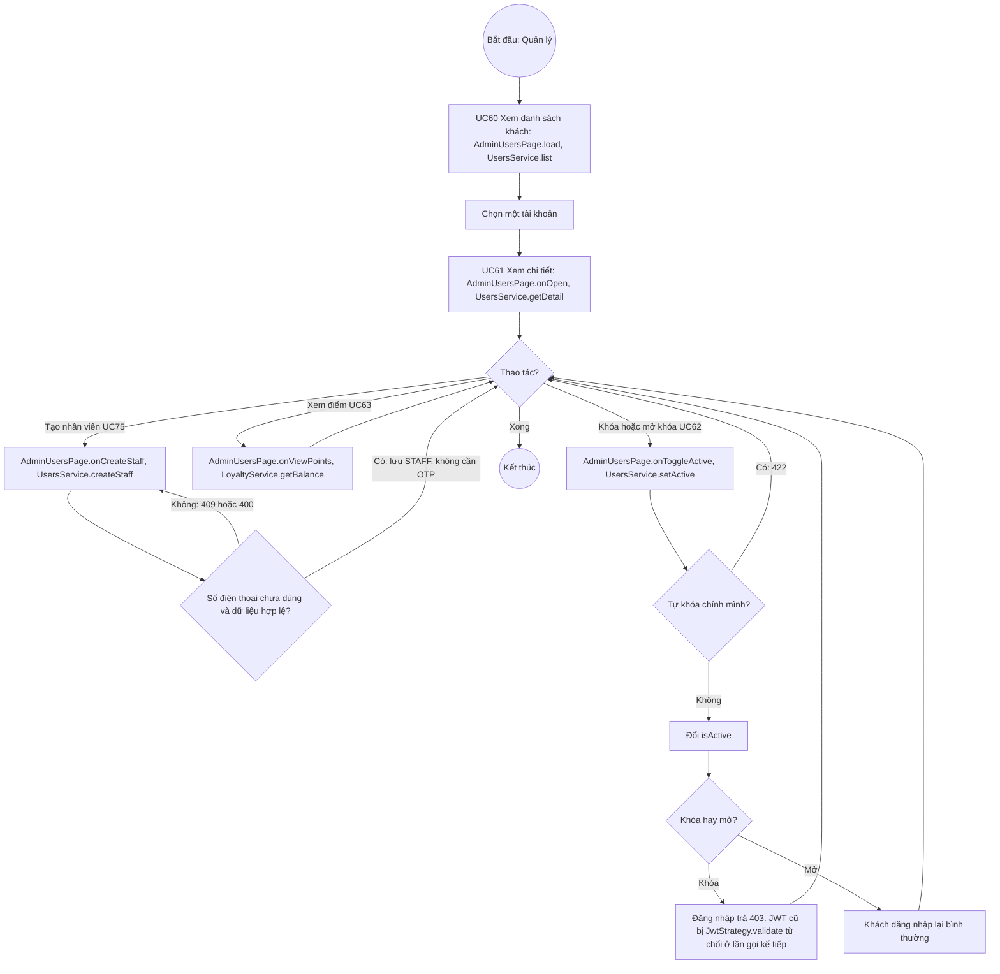

# 07 · Activity 09 — Quản lý người dùng (UC60–UC63, UC75, BFD nhóm 12)

Chi tiết gọi hàm ở `05-sequence/Sequence-11-QuanTriCRUD.md` mục B. Chỉ `MANAGER`. Quy tắc: BR17, BR18, BR46, BR47.

```mermaid
flowchart TD
  S((Bắt đầu: Quản lý)) --> A1["UC60 Xem danh sách khách: AdminUsersPage.load, UsersService.list"]
  A1 --> A2["Chọn một tài khoản"]
  A2 --> B1["UC61 Xem chi tiết: AdminUsersPage.onOpen, UsersService.getDetail"]
  B1 --> C0{"Thao tác?"}
  C0 -- "Tạo nhân viên UC75" --> N1["AdminUsersPage.onCreateStaff, UsersService.createStaff"]
  N1 --> N2{"Số điện thoại chưa dùng và dữ liệu hợp lệ?"}
  N2 -- "Không: 409 hoặc 400" --> N1
  N2 -- "Có: lưu STAFF, không cần OTP" --> C0
  C0 -- "Xem điểm UC63" --> D1["AdminUsersPage.onViewPoints, LoyaltyService.getBalance"] --> C0
  C0 -- "Khóa hoặc mở khóa UC62" --> E1["AdminUsersPage.onToggleActive, UsersService.setActive"]
  E1 --> E2{"Tự khóa chính mình?"}
  E2 -- "Có: 422" --> C0
  E2 -- "Không" --> E3["Đổi isActive"]
  E3 --> E4{"Khóa hay mở?"}
  E4 -- "Khóa" --> E5["Đăng nhập trả 403. JWT cũ bị JwtStrategy.validate từ chối ở lần gọi kế tiếp"] --> C0
  E4 -- "Mở" --> E6["Khách đăng nhập lại bình thường"] --> C0
  C0 -- "Xong" --> Z((Kết thúc))
```
