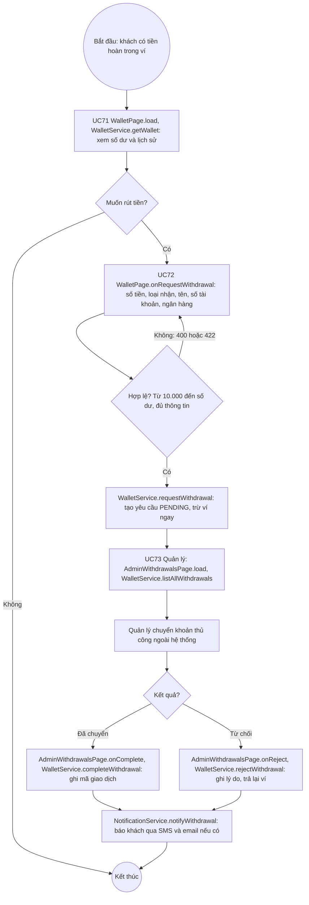

# 07 · Activity 11 — Ví hoàn tiền và rút tiền (UC71, UC72, UC73)

Chi tiết gọi hàm ở `05-sequence/Sequence-15-ViHoanTien.md`. Quy tắc: BR43, BR44.

```mermaid
flowchart TD
  S((Bắt đầu: khách có tiền hoàn trong ví)) --> A1["UC71 WalletPage.load, WalletService.getWallet: xem số dư và lịch sử"]
  A1 --> A2{"Muốn rút tiền?"}
  A2 -- "Không" --> Z((Kết thúc))
  A2 -- "Có" --> B1["UC72 WalletPage.onRequestWithdrawal: số tiền, loại nhận, tên, số tài khoản, ngân hàng"]
  B1 --> B2{"Hợp lệ? Từ 10.000 đến số dư, đủ thông tin"}
  B2 -- "Không: 400 hoặc 422" --> B1
  B2 -- "Có" --> B3["WalletService.requestWithdrawal: tạo yêu cầu PENDING, trừ ví ngay"]
  B3 --> C1["UC73 Quản lý: AdminWithdrawalsPage.load, WalletService.listAllWithdrawals"]
  C1 --> C2["Quản lý chuyển khoản thủ công ngoài hệ thống"]
  C2 --> C3{"Kết quả?"}
  C3 -- "Đã chuyển" --> D1["AdminWithdrawalsPage.onComplete, WalletService.completeWithdrawal: ghi mã giao dịch"]
  C3 -- "Từ chối" --> D2["AdminWithdrawalsPage.onReject, WalletService.rejectWithdrawal: ghi lý do, trả lại ví"]
  D1 --> E1["NotificationService.notifyWithdrawal: báo khách qua SMS và email nếu có"]
  D2 --> E1
  E1 --> Z
```
